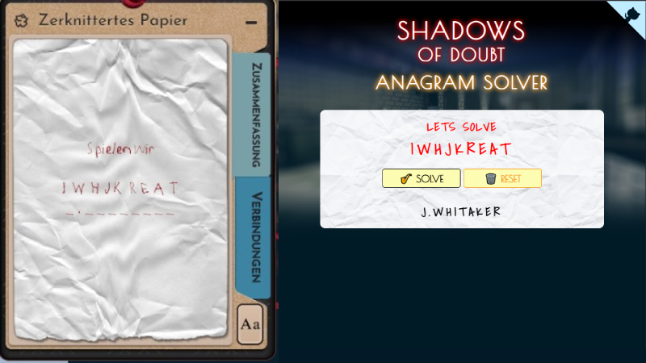

# Shadows of Doubt - Anagram Solver
Very little Webapp for solving the Citizen Anagrams in Shadow of Doubt



## URL
https://freakzero.github.io/sod-anagram/

## Update and Generate Nameslist
Current checked in Nameslists and generated Nameslist is from **Shadow of Doubt Version v41.04**  

Copy the `SteamLibrary\steamapps\common\Shadows of Doubt\Shadows of Doubt_Data\StreamingAssets\Strings\English\Citizens\Names` Folder into the `generator` directory  
run `node ./generator/merge.js <GAME_VERSION>` from root directory  

## Devserver
No dependency devserver with auto-inject live-reload over websockets  
```
node devserver.js
```